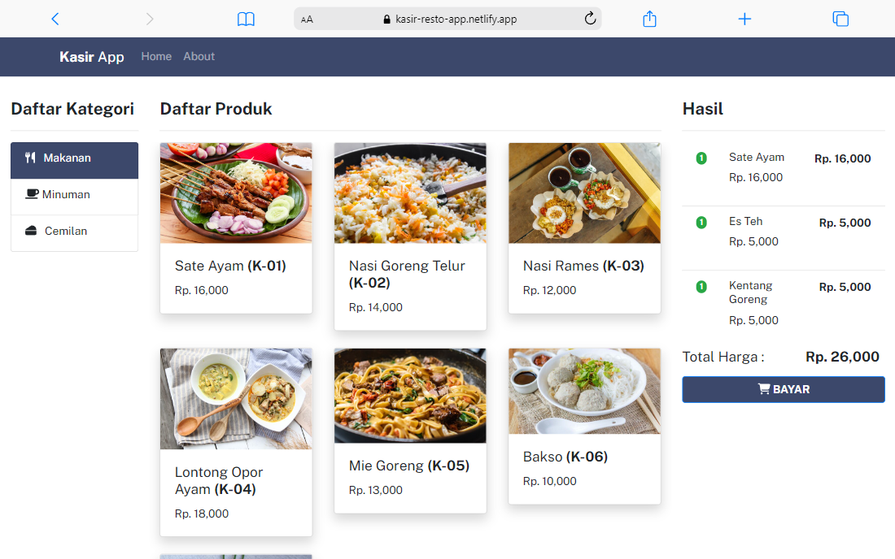

# Kasir App - Backend

 

Aplikasi Kasir adalah aplikasi kasir online untuk melakukan daftar makanan, minuman atau makanan ringan yang dipesan pelanggan.

## Teknologi
- JSON Server
- Cyclic

## SETUP DEPLOYMENT ENV

Cara menjalankan backend:
- Masuk direktori backend
- Install library Json Server dengan menjalankan perintah di bawah ini. (Jika sudah terinstall Anda bisa melewati bagian ini)

`npm install -g json-server`

- Jalankan perintah di bawah ini di terminal

`json-server --watch db.json --port=8000`

